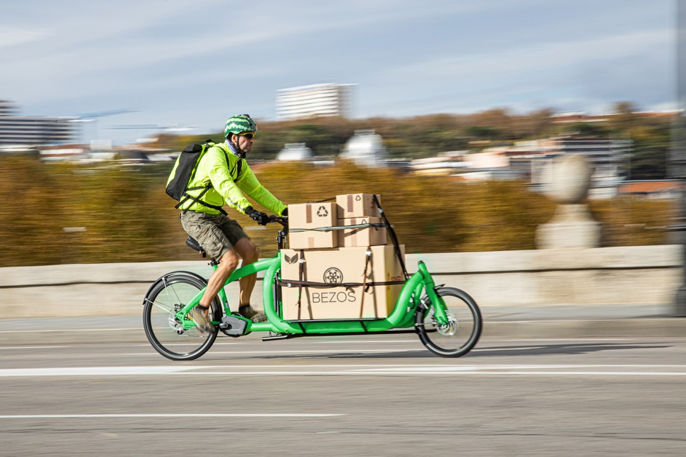

# green-delivery

## Introduction

### Green Delivery

[https://github.com/vietphan1995/green-delivery.git](https://github.com/vietphan1995/green-delivery.git)

Green Delivery is a software application which helps booking deliveries by green ways. Green ways can be listed as low to zero energy composition, safety and low cost.

Green Delivery encourage shipper use green vehicles like walking, electrical or physical bicycle, animal, public vehicles like train, bus.

Green Delivery booking progress concept should has enough shipper in authorized, shipper’s smart device, their shipping goods. Green Delivery application tracks shipper transport progress as their goods.

### [back to git projects …](https://github.com/vietphan1995/projects)

### Notes
https://phantrungviet.notion.site/green-delivery-1b35e832d6ee8023b61cf8f5ea371605